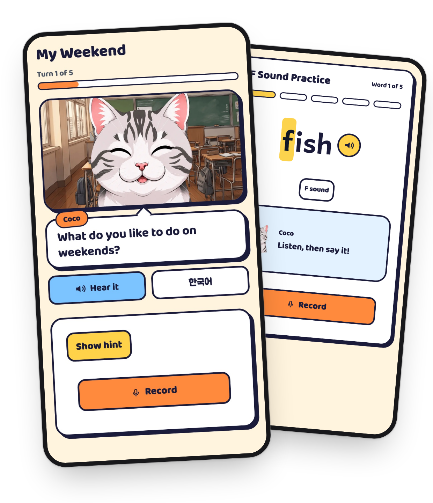
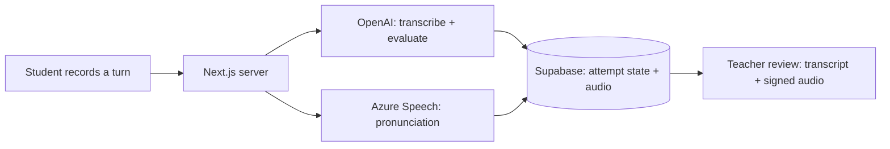

<h1 align="center">Coco English</h1>

<p align="center">
  AI speaking homework for elementary ESL classrooms.<br>
  Teachers assign short missions. Students practice out loud with Coco. Teachers review real transcripts and audio.
</p>

<p align="center">
  <a href="https://coco-english-demo.vercel.app"><strong>Try the live demo →</strong></a>
</p>

<p align="center">
  
  
  
  
  
</p>

<p align="center">
  
</p>

---

## Why

Young ESL learners rarely get enough speaking practice outside class, and teachers can't check whether homework speaking actually happened. Coco English turns the week's target language into short spoken missions and gives the teacher evidence of each student's practice.

## Features

**For students**
- Join with a class code, name, and PIN. No email or account needed.
- Speak through short missions with Coco, a friendly classmate character, not an open-ended chatbot.
- Get gentle, meaning-preserving corrections and hints in the moment.
- Practice pronunciation of target sounds with per-phoneme scoring.

**For teachers**
- Build **preset** missions (authored turns, with optional pictures) or **conversation** missions (an opening question with bounded AI follow-ups).
- Missions are snapshotted when assigned, so later edits never change homework already handed out.
- Review transcript-first, with per-turn audio playback.
- See a pronunciation profile for each student.

## How it works



- **Server-owned state.** Assignment and attempt transitions happen on the server and are auditable.
- **Ownership on every query.** Row-level security plus server-side ownership checks. Caller-supplied IDs are never trusted.
- **Private audio.** Clips are stored per turn and played back only through short-lived signed URLs.
- **Validated AI output.** Provider calls sit behind adapters with Zod schemas. Low-confidence or malformed results go to teacher review.
- **Bounded spend.** Server-side budgets cap paid provider calls ([ADR 0005](docs/adr/0005-bound-paid-provider-work.md)).

## Tech stack

| Layer | Tools |
| --- | --- |
| App | Next.js 15 (App Router), React 19, TypeScript, CSS Modules |
| Data | Supabase Postgres, Auth, Storage, row-level security |
| AI | OpenAI (transcription, evaluation, hints, TTS), Azure Speech (pronunciation) |
| Validation | Zod, React Hook Form |
| Testing | Vitest, Playwright |
| Hosting | Vercel (with daily crons), GitHub Actions for migrations |

## Running it

The easiest way to try Coco English is the [live demo](https://coco-english-demo.vercel.app). No account needed.

To run it locally, you need Node.js 20.19+, Docker, and OpenAI and Azure Speech keys in `.env.local` (see `.env.example`). Then:

```bash
npm install
bash scripts/with-local-supabase.sh npx next dev -p 3200
```

This starts a local Supabase stack in Docker, resets the local database, and refuses to run against anything but localhost.

## Testing

Vitest unit and integration tests, plus Playwright end-to-end suites for the classroom app and the public demo. Integration and E2E tests run against a local Supabase instance.

## Project docs

- [`PROJECT.md`](PROJECT.md): product and architecture overview
- [`GLOSSARY.md`](GLOSSARY.md): domain terms (preset vs. conversation missions, attempts, snapshots)
- [`docs/adr/`](docs/adr/): architecture decisions
- [`docs/features/`](docs/features/): feature specs, including pronunciation practice
- [`docs/azure-speech-data-use.md`](docs/azure-speech-data-use.md): how student audio is handled

## Acknowledgements

Pronunciation word lists use the [CMU Pronouncing Dictionary](vendor/cmudict/LICENSE).

## License

Copyright © 2026 John. All rights reserved. The code is public so people can read it, but it is not licensed for reuse.
